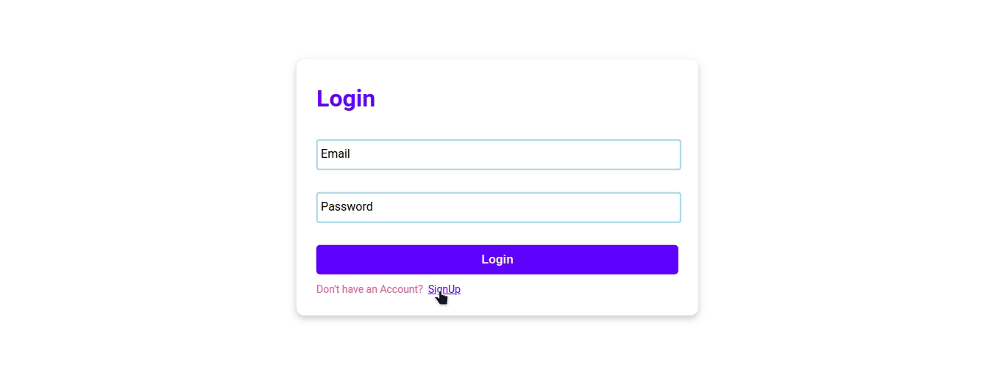

# Todo-App

This todo app is built using **React.js** and **Firebase** which helps to store the different tasks of different people in their own account.

# Installation

- Clone the repository
- Run
- `npm install`
- `npm start`

# Demo

You can find the todo-app live [here](https://karthiknayak024.github.io/Todo-app)
